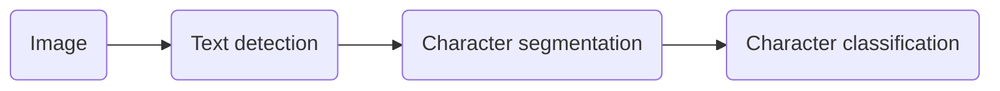

# Lecture 1

## 监督学习(Supervised Learning)
- 监督学习指的就是我们给学习算法一个数据集。这个数据集由“正确答案”组成，再根据这些样本作出预测。
- 回归问题，即通过回归来推出一个**连续**的输出。
- 分类问题，其目标是推出一组**离散**的结果。

<!--more -->

## 无监督学习(Unsupervised Learning)
- 在无监督学习中，我们已知的数据。不同于监督学习的数据，即无监督学习中没有任何的标签或者是有相同的标签或者就是没标签。
- 监督学习算法可能会把这些数据分成不同的簇，所以叫做聚类算法。

分离音频代码: `[W,s,v] = svd((repmat(sum(x.*x,1),size(x,1),1).*x)*x')`


---
# Lecture 2
本章主要介绍单变量线性回归问题，其中的一些基本概念和梯度下降法解决回归问题。

## 模型表示(Model Representation)
在监督学习中我们有一个数据集，这个数据集被称训练集(Training Set)。
- $m$: 训练集中实例的数量
- $x$: 特征/输入变量
- $y$: 目标/输出变量
- $(x, y)$: 训练集中的实例  
- $(x^{(i)}, y^{(i)})$: 第$i$个观察实例  
- $h$: 代表学习算法的解决方案或函数也称为假设函数(hypothesis), 从$x$到$y$的映射
    + 一种$h$的表达方式: $h_{\theta}(x) = \theta_{0} + \theta_{1}x$. 因为只含有一个特征/输入变量，因此这样的问题叫作单变量线性回归问题。

## 代价函数(Cost Function)
我们现在要做的便是为我们的模型选择合适的**参数**(**parameters**) $\theta_{0}$和$\theta_{1}$, 我们选择的参数决定了我们得到的直线相对于我们的训练集的准确程度，模型所预测的值与训练集中实际值之间的差距就是**建模误差**(**modeling error**)
我们的目标便是选择出可以使得建模误差的平方和能够最小的模型参数。 即使得代价函数 $J \left( \theta_0, \theta_1 \right) = \dfrac{1}{2m}\sum\limits_{i=1}^m \left( h_{\theta}(x^{(i)})-y^{(i)} \right)^{2}$ 最小。
- **代价函数**也被称作平方误差函数，有时也被称为平方误差代价函数。对于大多数问题，特别是回归问题，都是一个合理的选择。

## 梯度下降(Gradient Descent)
梯度下降是一个用来求函数最小值的算法，背后的思想是：开始时我们随机选择一个参数的组合$\left( {\theta_{0}},{\theta_{1}},......,{\theta_{n}} \right)$，计算代价函数，然后我们寻找下一个能让代价函数值下降最多的参数组合。我们持续这么做直到找到一个局部最小值（**local minimum**），因为我们并没有尝试完所有的参数组合，所以不能确定我们得到的局部最小值是否便是全局最小值（**global minimum**），选择不同的初始参数组合，可能会找到不同的局部最小值。
批量梯度下降(**batch gradient descent**)算法的公式为:
**repeat until convergence{**
$$\theta_{j}:=\theta_{j}-\alpha \dfrac{\partial}{\partial \theta_{j}} J\left(\theta_{0}, \theta_{1}\right)$$
**}**

其中$\alpha$是学习率(**learning rate**)，它决定了我们沿着能让代价函数下降程度最大的方向向下迈出的步子有多大，在批量梯度下降中，我们每一次都**同时**让所有的参数减去学习速率乘以代价函数的导数。

## 梯度下降的线性回归(Gradient Descent For Linear Regression)

对我们之前的线性回归问题运用梯度下降法，关键在于求出代价函数的导数，即:
$\dfrac{\partial}{\partial \theta_{j}} J(\theta_{0}, \theta_{1}) = \dfrac{\partial}{\partial \theta_{j}} \dfrac{1}{2m}\sum\limits_{i=1}^{m}(h_{\theta}(x^{(i)}) - y^{(i)})^{2}$

$j=0$ 时：$\dfrac{\partial}{\partial \theta_{0}}J(\theta_{0}, \theta_{1}) = \dfrac{1}{m}\sum\limits_{i=1}^{m}(h_{\theta}(x^{(i)}) - y^{(i)})$

$j=1$ 时：$\dfrac{\partial}{\partial \theta_{1}}J(\theta_{0}, \theta_{1}) = \dfrac{1}{m}\sum\limits_{i=1}^{m}((h_{\theta}(x^{(i)}) - y^{(i)}) \cdot x^{(i)})$

则算法改写成:
**repeat until convergence{**
$\qquad \theta_{0} := \theta_{0} - \alpha \dfrac{1}{m}\sum\limits_{i=1}^{m}(h_{\theta}(x^{(i)}) - y^{(i)})$
$\qquad \theta_{1} := \theta_{1} - \alpha \dfrac{1}{m}\sum\limits_{i=1}^{m}((h_{\theta}(x^{(i)}) - y^{(i)}) \cdot x^{(i)})$
​               **}**

- 如果你之前学过线性代数, 你应该知道有一种计算代价函数$J$最小值的数值解法, 这是另一种称为正规方程(**normal equations**)的方法。
- 实际上在数据量较大的情况下，梯度下降法比正规方程要更适用一些。

---
# Lecture 3
本章主要复习线性代数，虽然我线代没考好但是我觉得掌握的只是应该够用了，略(doge)。


---
# Lecture 4

## 多维特征 Multiple Features
多个变量的模型中的特征为$\left( {x_{1}},{x_{2}},...,{x_{n}} \right)$。
新的注释:
- $n$: 特征的数量
- $x^{\left( i \right)}$: 第 $i$ 个训练实例，是特征矩阵中的第$i$行，是一个**向量**（**vector**）
- $x_{j}^{\left( i \right)}$: 特征矩阵中第 $i$ 行的第 $j$ 个特征，也就是第 $i$ 个训练实例的第 $j$ 个特征

支持多变量的假设 $h$ 表示为：$h_{\theta}\left( x \right)=\theta_{0}+\theta_{1}x_{1}+\theta_{2}x_{2}+...+\theta_{n}x_{n}$，这个公式中有$n+1$个参数和$n$个变量，为了使得公式能够简化一些，引入$x_{0}=1$，则公式转化为：$h_{\theta} \left( x \right)=\theta_{0}x_{0} + \theta_{1}x_{1}+\theta_{2}x_{2}+...+\theta_{n}x_{n}$
此时模型中的参数是一个$n+1$维的向量，任何一个训练实例也都是$n+1$维的向量，特征矩阵$X$的维度是 $m*(n+1)$。 因此公式可以简化为：$h_{\theta} \left( x \right)=\theta^{T}X$，其中上标$T$代表矩阵转置。

## 多变量梯度下降 Gradient Descent for Multiple Variables
代价函数: $J\left( \theta_{0},\theta_{1}...\theta_{n} \right)=\dfrac{1}{2m}\sum\limits_{i=1}^{m}\left( h_{\theta} \left(x^{\left( i \right)} \right)-y^{\left( i \right)} \right)^{2}$ 
其中：$h_{\theta}\left( x \right)=\theta^{T}X=\theta_{0}+\theta_{1}x_{1}+\theta_{2}x_{2}+...+\theta_{n}x_{n}$， 我们的目标和单变量线性回归问题中一样，是要找出使得代价函数最小的一系列参数。
算法为:
**repeat until convergence{**
$$\theta_{j}:=\theta_{j}-\alpha \dfrac{\partial}{\partial \theta_{j}} J\left(\theta_{0}, \theta_{1}, ..., \theta_{n} \right)$$
**}**
即:
**repeat until convergence{**
$$\theta_{j}:=\theta_{j}-\alpha \dfrac{\partial}{\partial \theta_{j}} \dfrac{1}{2m} \sum\limits_{i=1}^{m}(h_{\theta}(x^{(i)}) - y^{(i)}) ^{2}$$
**}**
求导后得:
**repeat until convergence{**
$$\theta_{j}:=\theta_{j}-\alpha \dfrac{1}{m} \sum\limits_{i=1}^{m}((h_{\theta}(x^{(i)}) - y^{(i)}) * x_{j}^{(i)})$$
(simultaneously update $\theta_{j}$ for $i = 1,2,...,n$)

**}**
我们开始随机选择一系列的参数值，计算所有的预测结果后，再给所有的参数一个新的值，如此循环直到收敛。

``` python
def computeCost(X, y, theta):
    inner = np.power(((X * theta.T) - y), 2)
    return np.sum(inner) / (2 * len(X))
```

## 特征缩放 Feature Scaling
在我们面对多维特征问题的时候，我们要保证这些特征都具有相近的尺度，这将帮助梯度下降算法更快地收敛(标准化，归一化)。
- 最简单的方法是令：$x_{n}=\dfrac{x_{n}-\mu_{n}}{s_{n}}$，其中 $\mu_{n}$是平均值，$s_{n}$是标准差。

## 学习率 Learning Rate
梯度下降算法的每次迭代受到学习率的影响，如果学习率$\alpha$过小，则达到收敛所需的迭代次数会非常高；如果学习率$\alpha$过大，每次迭代可能不会减小代价函数，可能会越过局部最小值导致无法收敛。

## 特征和多项式回归 Features and Polynomial Regression
线性回归并不适用于所有数据，有时我们需要曲线来适应我们的数据, 通常我们需要先观察数据然后再决定准备尝试怎样的模型。
- 我们可以令：$x_{2}=x^{2},x_{3}=x^{3}$，从而将模型转化为线性回归模型。
- 如果我们采用多项式回归模型，在运行梯度下降算法前，特征缩放非常有必要。

## 正规方程 Normal Equation
正规方程是通过求解下面的方程来找出使得代价函数最小的参数的：$\dfrac{\partial}{\partial \theta_{j}}J\left( \theta_{j} \right)=0$ 。
 假设我们的训练集特征矩阵为 $X$（包含了 $x_{0}=1$）并且我们的训练集结果为向量 $y$，则利用正规方程解出向量 $\theta =\left( X^{T}X \right)^{-1}X^{T}y$.
上标$T$代表矩阵转置，上标$-1$代表矩阵的逆。

- 只要特征变量的数目并不大，标准方程是一个很好的计算参数$\theta $的替代方法。具体地，只要特征变量数量小于一万，标准方程法，而不使用梯度下降法。

``` python 
import numpy as np
    
def normalEqn(X, y):
    theta = np.linalg.inv(X.T@X)@X.T@y #X.T@X等价于X.T.dot(X)
    return theta
```

---
# Lecture 5
本章主要是**Ovtave**的语法学习，现在基本使用**Python**，跳过本章。


---
# Lecture 6
本章主要是对于解决分类问题的逻辑回归算法的讲解。

## 分类问题 Classification
我们将因变量(**dependent variable**)可能属于的两个类分别称为负向类（**negative class**）和正向类（**positive class**），则因变量$y\in \{ 0,1 \}$ ，其中 0 表示负向类，1 表示正向类。

## 假说表示 Hypothesis Representation
我们希望我们的分类器的输出值在**0和1之间**，因此，我们希望想出一个满足某个性质的假设函数，这个性质是它的预测值要在0和1之间。
我们引入一个新的模型，逻辑回归，该模型的输出变量范围始终在0和1之间。
逻辑回归模型的假设是： $h_{\theta}(x) = g(\theta^{T}X)$
其中：
$X$ 代表特征向量
$g$ 代表逻辑函数（**logistic function**)是一个常用的逻辑函数为**S**形函数（**Sigmoid function**），公式为： $g(z) = \dfrac{1}{1 + e^{-z}}$.

``` python sigmoid
import numpy

def sigmoid(z):
    return 1 / (1 + np.exp(-z))
```
函数图像为:

$h_{\theta}( x )$的作用是，对于给定的输入变量，根据选择的参数计算输出变量=1的可能性（**estimated probablity**）即$h_{\theta} ( x )=P( y=1|x;\theta)$

## 判定边界 Decision Boundary
线性规划？反正就是约束条件所导致的曲线分界线。
我们可以用非常复杂的模型来适应非常复杂形状的判定边界。

## 代价函数
对于线性回归模型，我们定义的代价函数是所有模型误差的平方和。理论上来说，我们也可以对逻辑回归模型沿用这个定义，但是问题在于，当我们将$h_{\theta}(x) = \dfrac{1}{1 + e^{-\theta^{T}X}}$带入到这样定义了的代价函数中时，我们得到的代价函数将是一个非凸函数（**non-convexfunction**）。
这意味着我们的代价函数有许多**局部最小值**，这将影响梯度下降算法寻找全局最小值。
我们重新定义逻辑回归的代价函数为: $J(\theta) = \dfrac{1}{m}\sum\limits_{i=1}^{n} Cost(h_{\theta}(x^{(i)}), y^{(i)})$, 其中
$$cost(h_{\theta}(x^{(i)}), y^{(i)})=\left\{
\begin{aligned}
 \log{(h_{\theta}(x))}, &y = 1\\
 \log{(1- h_{\theta}(x))}, &y = 0
\end{aligned}
\right.$$

再简化得:
$$Cost(h_{\theta}(x^{(i)}), y^{(i)}) = -y \times \log{(h_{\theta}(x))} - (1 - y) \times \log{(1- h_{\theta}(x))}$$
带入代价函数得:
$$J(\theta) = -\dfrac{1}{m}\sum\limits_{i=1}^{n} [y \times \log{(h_{\theta}(x))} + (1 - y) \times \log{(1- h_{\theta}(x))}] $$

``` python cost
import numpy as np

def cost(theta, X, y):
    theta = np.matrix(theta)
    X = np.matrix(X)
    y = np.matrix(y)
    first = np.multiply(-y, np.log(sigmoid(X* theta.T)))
    second = np.multiply((1 - y), np.log(1 - sigmoid(X* theta.T)))
    return np.sum(first - second) / (len(X))

# python实现的tips: 一般都是将输入用np.matrix向量化，再通过np的一些方法(np.sum, np.multiply)来运算，减少循环
```

凸性分析的内容是超出这门课的范围的，但是可以证明我们所选的代价值函数会给我们一个凸优化问题。代价函数$J(\theta)$会是一个凸函数，并且没有局部最优值。

在得到这样一个代价函数以后，我们便可以用梯度下降算法来求得能使代价函数最小的参数了。
**repeat until convergence{**
$$\theta_{j}:=\theta_{j}-\alpha \dfrac{\partial}{\partial \theta_{j}} J\left(\theta \right)$$
**}**

考虑$h_{\theta}(x) = \dfrac{1}{1 + e^{-\theta^{T}X}}$, 有：
$$\dfrac{\partial}{\partial \theta_{j}} J(\theta) = \dfrac{1}{m} \sum\limits_{i=1}^{n} \left[(h_{\theta}(x^{(i)}) -y^{(i)}) x_{j}^{(i)}\right]$$
~~推导略，不信的话自己去算算~~

- 虽然得到的梯度下降算法表面上看上去与线性回归的梯度下降算法一样，但是这里的$h_{\theta}(x)$与线性回归中不同，所以实际上是不一样的。另外，在运行梯度下降算法之前，进行特征缩放依旧是非常必要的。

除了梯度下降算法以外，还有一些常被用来令代价函数最小的算法，这些算法更加复杂和优越，而且通常不需要人工选择学习率，通常比梯度下降算法要更加快速。这些算法有：**共轭梯度**（**Conjugate Gradient**），**局部优化法**(**Broyden fletcher goldfarb shann,BFGS**)和**有限内存局部优化法**(**LBFGS**) 

## 多类别分类 Multiclass Classification
对每一个类别，创建一个新“伪”的训练集，拟合一个合适的分类器。
就是将一个类标为正类，其他都为负类，得到一系列模型记为$h_{\theta}^{(i)}(x) = p(y = i | x;\theta), i = 1,2,...,k$
最后，在我们需要做预测时，我们将所有的分类机都运行一遍，然后对每一个输入变量，都选择最高可能性的输出变量。


---
# Lecture 7
本章主要介绍**正则化方法(Regularization)**，它可以改善或者减少过度拟合问题。

## 过拟合问题 Overfitting
- 丢弃一些不能帮助我们正确预测的特征。可以是手工选择保留哪些特征，或者使用一些模型选择的算法来帮忙（例如**PCA**）
- 正则化。 保留所有的特征，但是减少参数的大小（**magnitude**）。

## 代价函数
某些项导致了过拟合的产生，所以如果我们能让这些项系数接近于0的话，我们就能很好的拟合了。
所以我们要做的就是在一定程度上减小这些参数$\theta$ 的值，这就是正则化的基本方法。我们要做的便是修改代价函数，为$\theta$设置一点惩罚。
假如我们有非常多的特征，我们并不知道其中哪些特征我们要惩罚，我们将对所有的特征进行惩罚，并且让代价函数最优化的软件来选择这些惩罚的程度。这样的结果是得到了一个较为简单的能防止过拟合问题的假设：
$$J(\theta) = \dfrac{1}{2m}\left[\sum\limits_{i=1}^{m} (h_{\theta}(x^{(i)}) - y^{(i)})^{2} + \lambda \sum\limits_{j=1}^{n} \theta_{j}^{2}\right]$$
其中$\lambda$又称为正则化参数（**Regularization Parameter**）。 注：根据惯例，我们不对$\theta_{0}$ 进行惩罚。

## 正则化线性回归 Regularized Linear Regression
**repeat until convergence{**
$$\theta_{0}:=\theta_{0}-\alpha \dfrac{1}{m} \sum_{i=1}^{m}((h_{\theta}(x^{(i)}) - y^{(i)})$$
$$\theta_{j}:=\theta_{j}-\alpha \left[\dfrac{1}{m} \sum_{i=1}^{m}((h_{\theta}(x^{(i)}) - y^{(i)}) * x_{j}^{(i)}) + \dfrac{\lambda}{m}\theta_{j}\right] \quad (for~j=1,2,...,n)$$
**}**
对$j=1,2,...,n$时的更新式子整理得：
$$\theta_{j}:=\theta_{j}(1 - \alpha \dfrac{\lambda}{m})-\alpha \dfrac{1}{m} \sum_{i=1}^{m}((h_{\theta}(x^{(i)}) - y^{(i)}) * x_{j}^{(i)})$$
可以看出，正则化线性回归的梯度下降算法的变化在于，每次都在原有算法更新规则的基础上令$\theta$值减少了一个额外的值。

我们同样也可以利用正规方程来求解正则化线性回归模型：
$$\theta=\left(X^{T} X+\lambda\left[\begin{array}{cccc}
0 & & & \\
& 1 & & \\
& & 1 & & \\
& & & \ddots & \\
& & & & 1
\end{array}\right]\right)^{-1} X^{T} y$$
矩阵尺寸为 $(n+1)*(n+1)$。

## 正则化的逻辑回归模型 Regularized Logistic Regression

$$J(\theta) = -\dfrac{1}{m}\sum\limits_{i=1}^{n} [y \times \log{(h_{\theta}(x))} + (1 - y) \times \log{(1- h_{\theta}(x))}] + \dfrac{\lambda}{2m} \sum\limits_{j=1}^{n}\theta_{j}^{2}$$

``` python python代码
import numpy as np

def costReg(theta, X, y, learningRate):
    theta = np.matrix(theta)
    X = np.matrix(X)
    y = np.matrix(y)
    first = np.multiply(-y, np.log(sigmoid(X*theta.T)))
    second = np.multiply((1 - y), np.log(1 - sigmoid(X*theta.T)))
    reg = (learningRate / (2 * len(X))* np.sum(np.power(theta[:,1:theta.shape[1]],2))
    return np.sum(first - second) / (len(X)) + reg
```
梯度下降：
**repeat until convergence{**
$$\theta_{0}:=\theta_{0}-\alpha \dfrac{1}{m} \sum_{i=1}^{m}((h_{\theta}(x^{(i)}) - y^{(i)})$$
$$\theta_{j}:=\theta_{j}-\alpha \left[\dfrac{1}{m} \sum_{i=1}^{m}((h_{\theta}(x^{(i)}) - y^{(i)}) * x_{j}^{(i)}) + \dfrac{\lambda}{m}\theta_{j}\right] \quad (for~j=1,2,...,n)$$
**}**
注：看上去同线性回归一样，但是知道 $h_\theta ( x )=g( \theta^{T} X )$，所以与线性回归不同。


---
# Lecture 8
本章主要对**神经网络Neural Network**进行表述。

## 非线性假设 Non-linear Hypotheses
当特征太多时，计算的负荷会非常大。
普通的逻辑回归模型，不能有效地处理这么多的特征，这时候我们需要神经网络。

## 神经元和大脑 Neurons and the Brain
~~生物知识~~。人工智能的梦想就是：有一天能制造出真正的智能机器。

## 模型表示 Model Representation
神经网络模型建立在很多神经元之上，每一个神经元又是一个个学习模型。这些神经元（也叫激活单元，**activation unit**）采纳一些特征作为输出，并且根据本身的模型提供一个输出。

下图是一个以逻辑回归模型作为自身学习模型的神经元示例，在神经网络中，参数又可被成为权重（**weight**）。


我们设计出了类似于神经元的神经网络，效果如下：


其中$x_1$, $x_2$, $x_3$是输入单元（**input units**），我们将原始数据输入给它们。

$a_1$, $a_2$, $a_3$是中间单元，它们负责将数据进行处理，然后呈递到下一层。

最后是输出单元，它负责计算$h_\theta ( x )$。

神经网络模型是许多逻辑单元按照不同层级组织起来的网络，每一层的输出变量都是下一层的输入变量。上图为一个三层神经网络，第一层称为输入层（**Input Layer**），最后一层称为输出层（**Output Layer**），中间一层成为隐藏层（**Hidden Layers**）。我们为每一层都增加一个偏差单位（**bias unit**）。

下面引入一些标记法来帮助描述模型：
- $a_{i}^{(j)}$：第$j$ 层的第 $i$ 个激活单元。
- $\theta^{(j)}$：从第 $j$ 层映射到第$ j+1$ 层时的权重的矩阵。其尺寸为：以第 $j+1$层的激活单元数量为行数，以第 $j$ 层的激活单元数加一为列数的矩阵。

对于上图所示的模型，激活单元和输出分别表达为：
$a_{1}^{(2)} = g(\Theta_{10}^{(1)}x_{0} + \Theta_{11}^{(1)}x_{1} + \Theta_{12}^{(1)}x_{2} +  \Theta_{13}^{(1)}x_{3})$

$a_{2}^{(2)} = g(\Theta_{20}^{(1)}x_{0} + \Theta_{21}^{(1)}x_{1} + \Theta_{22}^{(1)}x_{2} +  \Theta_{23}^{(1)}x_{3})$

$a_{3}^{(2)} = g(\Theta_{30}^{(1)}x_{0} + \Theta_{31}^{(1)}x_{1} + \Theta_{32}^{(1)}x_{2} +  \Theta_{33}^{(1)}x_{3})$

$h_{\Theta}(x) = g(\Theta_{10}^{(2)}a_{0} + \Theta_{11}^{(2)}a_{1} + \Theta_{12}^{(2)}a_{2} +  \Theta_{13}^{(2)}a_{3})$

上面进行的讨论中只是将特征矩阵中的一列（一个训练实例）喂给了神经网络，我们需要将整个训练集都喂给我们的神经网络算法来学习模型。

我们可以知道：每一个$a$都是由上一层所有的$x$和每一个$x$所对应的决定的。
（我们把这样从左到右的算法称为前向传播算法( **FORWARD PROPAGATION** )）

把$x$, $\theta$, $a$ 分别用矩阵表示，我们可以得到$\Theta \cdot X=a$ 。

我们可以把$a_0, a_1, a_2, a_3$看成更为高级的特征值，也就是$x_0, x_1, x_2, x_3$的进化体，并且它们是由 $x$与$\theta$决定的，因为是梯度下降的，所以$a$是变化的，并且变得越来越厉害，所以这些更高级的特征值远比仅仅将 $x$次方厉害，也能更好的预测新数据。

这就是神经网络相比于逻辑回归和线性回归的优势。

## 多类分类
当我们有不止两种分类时，输出层多个神经元来表示多类。

也就是每一个数据在输出层都会出$\{ a_{1}, a_{2}, ..., a_{k} \}$，且$a_{i}$中仅有一个为1，表示当前类。


---

# Lecture 9

本章主要是神经网络的学习训练，其代价函数，检验以及初始化相关的介绍。

## 代价函数
首先引入一些标记：
假设神经网络的训练样本有 $m$ 个，每个包含一组输入 $x$ 和一组输出信号 $y$，$L$ 表示神经网络层数，$S_I$ 表示每层的**neuron**个数($S_l$ 表示输出层神经元个数)，$S_L$ 代表最后一层中处理单元的个数。
二类分类： $S_L = 0, y = 0 ~ or ~ 1$；
$K$类分类： $S_L = K, y_i = 1$ 表示分到第$i$类（$k >2$）。

逻辑回归中的代价函数为：
$$J(\theta) = -\dfrac{1}{m}\sum\limits_{i=1}^{n} [y \times \log{(h_{\theta}(x))} + (1 - y) \times \log{(1- h_{\theta}(x))}] $$

在逻辑回归中，只有一个输出变量，又称标量（**scalar**），也只有一个因变量$y$，但是在神经网络中，可以有很多输出变量，我们的$h_\theta(x)$是一个维度为$K$的向量，并且我们训练集中的因变量也是同样维度的一个向量，因此我们的代价函数会比逻辑回归更加复杂一些，为：
$h_{\theta} (x) \in \mathbb{R}^K$，$(h_{\theta} (x))_i = i$-th output

$J(\theta) = - \dfrac{1}{m} \left[ \sum\limits_{i = 1}^{m} \sum\limits_{k=1}^{K} y_k^{(i)} \log{(h_{\theta}(x^{(i)})_k)} + (1 - y_k^{(i)})\log{(1 - (h_{\theta} (x^{(i)}))_k)} + \dfrac{\lambda}{2m} \sum\limits_{l = 1}^{L-1} \sum\limits_{i=1}^{s_l}\sum\limits_{j=1}^{s_{l+1}} \right]$

这个看起来复杂很多的代价函数背后的思想还是一样的，我们希望通过代价函数来观察算法预测的结果与真实情况的误差有多大，唯一不同的是，对于每一行特征，我们都会给出$K$个预测，基本上我们可以利用循环，对每一行特征都预测$K$个不同结果，然后在利用循环在$K$个预测中选择可能性最高的一个，将其与$y$中的实际数据进行比较。

$h_\theta(x)$与真实值之间的距离为每个样本-每个类输出的加和，对参数进行**regularization**的**bias**项处理所有参数的平方和。

## 反向传播算法 Backpropagation Algorithm
为了计算代价函数的偏导数$\dfrac{\partial}{\partial\Theta^{(l)}_{ij}}J\left(\Theta\right)$，我们需要采用一种反向传播算法。也就是首先计算最后一层的误差，然后再一层一层反向求出各层的误差，直到倒数第二层。

e.g.
$K=4, S_L = 4,L=4$

从最后一层的误差开始计算，误差是激活单元的预测（$a^{(4)}$）与实际值（$y^k$）之间的误差，（$k=1:k$）。

我们用$\delta$来表示误差，则：$\delta^{(4)}=a^{(4)}-y$，然后利用这个误差值来计算前一层误差，则：$\delta^{(3)} = \left( \Theta^{(3)} \right)^T \delta^{(4)} * g'\left( z^{3} \right)$。

其中 $g'(z^{(3)})$是 $S$ 形函数的导数，$g'(z^{(3)})=a^{(3)}\ast(1-a^{(3)})$。而$(θ^{(3)})^{T}\delta^{(4)}$则是权重导致的误差的和。

我们有了所有的误差的表达式后，便可以计算代价函数的偏导数了，假设$λ=0$，即我们不做任何正则化处理时有：
$\dfrac{\partial}{\partial\Theta_{ij}^{(l)}}J(\Theta)=a_{j}^{(l)} \delta_{i}^{l+1}$

上面式子中上下标的含义：
- $l$：目前计算的是第几层。
- $j$：目前计算的激活单元的下标，也将是下一层的第$j$个输入变量的下标。
- $i$：下一层中误差单元的下标，是受到权重矩阵中第$i$行影响的下一层中的误差单元的下标。

误差单元也是一个矩阵，我们用$\Delta^{(l)}_{ij}$来表示这个误差矩阵。第 $l$  层的第 $i$ 个激活单元受到第 $j$ 个参数影响而导致的误差。

算法表示为：


即首先用正向传播方法计算出每一层的激活单元，利用训练集的结果与神经网络预测的结果求出最后一层的误差，然后利用该误差运用反向传播法计算出直至第二层的所有误差。

在求出了$\Delta_{ij}^{(l)}$之后，我们便可以计算代价函数的偏导数了，计算方法如下：
$D_{ij}^{(l)} :=\dfrac{1}{m}\Delta_{ij}^{(l)}+\lambda\Theta_{ij}^{(l)}$              ${if}\; j \neq  0$

$D_{ij}^{(l)} :=\dfrac{1}{m}\Delta_{ij}^{(l)}$                             ${if}\; j = 0$

- 我们可以想象 $\delta^{(l)}_{j}$ 为函数求导时迈出的那一丁点微分，所以更准确的说 $\delta^{(l)}_{j}=\frac{\partial}{\partial z^{(l)}_{j}}cost(i)$

## 梯度检验 Gradient Checking
当我们对一个较为复杂的模型（例如神经网络）使用梯度下降算法时，可能会存在一些不容易察觉的错误，意味着，虽然代价看上去在不断减小，但最终的结果可能并不是最优解。
为了避免这样的问题，我们采取一种叫做梯度的数值检验（**Numerical Gradient Checking**）方法。这种方法的思想是通过估计梯度值来检验我们计算的导数值是否真的是我们要求的。
（就模拟求导看看我们用$\delta$算出来的对不对）

对$\theta_1$进行检验：
 $\dfrac{\partial}{\partial\theta_1}=\dfrac{J\left(\theta_1+\varepsilon_1,\theta_2,\theta_3...\theta_n \right)-J \left( \theta_1-\varepsilon_1,\theta_2,\theta_3...\theta_n \right)}{2\varepsilon}$

 根据上面的算法，计算出的偏导数存储在矩阵 $D_{ij}^{(l)}$ 中。检验时，我们要将该矩阵展开成为向量，同时我们也将 $\theta$ 矩阵展开为向量，我们针对每一个 $\theta$ 都计算一个近似的梯度值，将这些值存储于一个近似梯度矩阵中，最终将得出的这个矩阵同 $D_{ij}^{(l)}$ 进行比较。

 ## 随机初始化 Random Initialization
 任何优化算法都需要一些初始的参数。到目前为止我们都是初始所有参数为0，这样的初始方法对于逻辑回归来说是可行的，但是对于神经网络来说是不可行的。如果我们令所有的初始参数都为0，这将意味着我们第二层的所有激活单元都会有相同的值。同理，如果我们初始所有的参数都为一个非0的数，结果也是一样的。

- 我们通常初始参数为正负ε之间的随机值。

## 综合起来 Put It Together
小结一下使用神经网络时的步骤：
- 网络结构：第一件要做的事是选择网络结构，即决定选择多少层以及决定每层分别有多少个单元。
  + 第一层的单元数即我们训练集的特征数量。
  + 最后一层的单元数是我们训练集的结果的类的数量。
  + 如果隐藏层数大于1，确保每个隐藏层的单元个数相同，通常情况下隐藏层单元的个数越多越好。
  + 我们真正要决定的是隐藏层的层数和每个中间层的单元数。

- 训练神经网络
  1. 参数的随机初始化。
  2. 利用正向传播方法计算所有的$h_{\theta}(x)$。
  3. 编写计算代价函数 $J$ 的代码。
  4. 利用反向传播方法计算所有偏导数。
  5. 利用数值检验方法检验这些偏导数。
  6. 使用优化算法来最小化代价函数。


---

# Lecture 10

本章主要是吴恩达对于机器学习的一些技巧经验建议，包括如何调参，如何判断欠拟合或过拟合等等。**本章非常重要**，掌握了调参技巧可以节约非常多的~~生命~~时间。

## 下一步做什么 Decide What to Try Next

当我们运用训练好了的模型来预测未知数据的时候发现有较大的误差，我们下一步可以做什么？

1. 获得更多的训练样本——通常是有效的，但代价较大，下面的方法也可能有效，可考虑先采用下面的几种方法。
2. 尝试减少特征的数量
3. 尝试获得更多的特征
4. 尝试增加多项式特征
5. 尝试减少正则化程度$\lambda$
6. 尝试增加正则化程度$\lambda$


## 评估一个假设 Evaluating a hypothesis

当我们确定学习算法的参数的时候，我们考虑的是选择参量来使训练误差最小化，有人认为得到一个非常小的训练误差一定是一件好事，但我们已经知道，仅仅是因为这个假设具有很小的训练误差，并不能说明它就一定是一个好的假设函数。而且我们也学习了过拟合假设函数的例子，所以这推广到新的训练集上是不适用的。

所以我们时常需要判断一个假设函数是否过拟合或欠拟合。

我们可以对假设函数$h(x)$进行画图，然后观察图形趋势，但对于有很多特征变量的问题，想要通过画出假设函数来进行观察，就会变得很难甚至是不可能实现。

另一种方法检验是否过拟合，将数据分成训练集和测试集，通常用70%的数据作为训练集，用剩下30%的数据作为测试集，如果数据有某种规律，要打乱再分。

测试集是用来评估训练集训练出的学习模型的参数，对测试集运用该模型，计算误差：

- 线性回归模型，计算测试集数据的代价函数 $J$
- 逻辑回归模型，除了代价函数 $J_{t e s t}(\theta)=-\dfrac{1}{m_{\text {test }}} \sum\limits_{i=1}^{m_{test }} y_{test}^{(i)} \log h_{\theta}(x_{test }^{(i)})+(1-y_{test }^{(i)}) \log h_{\theta}(x_{test }^{(i)})$，我们还可以计算错误分类的比率: $err(h_{\theta}(x), y)=\left\{\begin{array}{c}
  1 \text { ,if } h(x) \geq 0.5 \text { and } y=0, \text { or if } h(x)<0.5 \text { and } y=1 \\
  0 \text { ,otherwise }
  \end{array}\right.$ ，再求平均。


## 模型选择和交叉验证集 Model Selection and Train_Validation_Test Sets

我们需要使用交叉验证集来帮助选择模型（多项式次数）。

使用60%的数据作为训练集，使用 20%的数据作为交叉验证集，使用20%的数据作为测试集。

模型选择的方法：

1. 用训练集训练出10个模型
2. 用10个模型分别对交叉验证集计算得出交叉验证误差（代价函数的值）
3. 选取代价函数值最小的模型
4. 用步骤3中选出的模型对测试集计算得出推广误差（代价函数的值）


## 诊断偏差和方差 Diagnosing Bias vs. Variance

当运行一个学习算法时，如果这个算法的表现不理想，那么多半是出现两种情况：要么是偏差比较大，要么是方差比较大。换句话说，出现的情况要么是欠拟合，要么是过拟合问题。

我们通常会通过将训练集和交叉验证集的代价函数误差与多项式的次数绘制在同一张图表上来帮助分析：


对于训练集，当 $d$ 较小时，模型拟合程度更低，误差较大；随着 $d$ 的增长，拟合程度提高，误差减小。

对于交叉验证集，当 $d$ 较小时，模型拟合程度低，误差较大；但是随着 $d$ 的增长，误差呈现先减小后增大的趋势，转折点是我们的模型开始过拟合训练数据集的时候。

- 训练集误差和交叉验证集误差近似时：偏差/欠拟合。
- 交叉验证集误差远大于训练集误差时：方差/过拟合。


## 正则化和偏差/方差 Regularization and Bias_Variance

在我们在训练模型的过程中，一般会使用一些正则化方法来防止过拟合。但是我们可能会正则化的程度太高或太小了，即我们在选择λ的值时也需要思考与刚才选择多项式模型次数类似的问题。

我们选择一系列的想要测试的 $\lambda$ 值，通常是 0-10之间的呈现2倍关系的值（如：$0,0.01,0.02,0.04,0.08,0.15,0.32,0.64,1.28,2.56,5.12,10$共12个）。 我们同样把数据分为训练集、交叉验证集和测试集。

选择 $\lambda$ 的方法为：

1. 使用训练集训练出12个不同程度正则化的模型
2. 用12个模型分别对交叉验证集计算的出交叉验证误差
3. 选择得出交叉验证误差**最小**的模型
4. 运用步骤3中选出模型对测试集计算得出推广误差，我们也可以同时将训练集和交叉验证集模型的代价函数误差与λ的值绘制在一张图表上：
   - 注意到这里训练的时候加正则项，评估的时候不要正则项。


• 当 $\lambda$ 较小时，训练集误差较小（过拟合）而交叉验证集误差较大

• 随着 $\lambda$ 的增加，训练集误差不断增加（欠拟合），而交叉验证集误差则是先减小后增加


## 学习曲线 Learning Curves

学习曲线是学习算法的一个很好的**合理检验**（**sanity check**）。学习曲线是将训练集误差和交叉验证集误差作为训练集样本数量（$m$）的函数绘制的图表。

当训练较少行数据的时候，训练的模型将能够非常完美地适应较少的训练数据，但是训练出来的模型却不能很好地适应交叉验证集数据或测试集数据。

- 高偏差/欠拟合时，交叉验证集和训练集的曲线会很接近，无论训练集有多么大误差都不会有太大改观：


- 高方差/过拟合时，训练集误差很小，交叉验证集误差远大于训练集误差，往训练集增加更多数据可以提高模型的效果：

  

## 决定下一步做什么 Deciding What to Do Next Revisite

回顾 1.1 中提出的六种可选的下一步，让我们来看一看我们在什么情况下应该怎样选择：

1. 获得更多的训练样本——解决高方差

2. 尝试减少特征的数量——解决高方差

3. 尝试获得更多的特征——解决高偏差

4. 尝试增加多项式特征——解决高偏差

5. 尝试减少正则化程度λ——解决高偏差

6. 尝试增加正则化程度λ——解决高方差

神经网络的方差和偏差：


使用较小的神经网络，类似于参数较少的情况，容易导致高偏差和欠拟合，但计算代价较小使用较大的神经网络，类似于参数较多的情况，容易导致高方差和过拟合，虽然计算代价比较大，但是可以通过正则化手段来调整而更加适应数据。
- 通常选择较大的神经网络并采用正则化处理会比采用较小的神经网络效果要好。

对于神经网络中的隐藏层的层数的选择，通常从一层开始逐渐增加层数，为了更好地作选择，可以把数据分为训练集、交叉验证集和测试集，针对不同隐藏层层数的神经网络训练神经网络，
然后选择交叉验证集代价最小的神经网络。


---

# Lecture 11

本章主要是讲述机器学习系统的设计技巧，对于误差的分析。


## 误差分析 Error Analysis

> 构造机器学习应用程序，最好的实践方法不是建立一个非常复杂的系统，拥有多么复杂的变量；而是构建一个简单的算法，这样你可以很快地实现它。

构建一个学习算法的推荐方法为：

1. 从一个简单的能快速实现的算法开始，实现该算法并用交叉验证集数据测试这个算法。
2. 绘制学习曲线，决定是增加更多数据，或者添加更多特征，还是其他选择。（参考 Lecture 10）
3. 进行误差分析：人工检查交叉验证集中我们算法中产生预测误差的样本，看看这些样本是否有某种系统化的趋势。

误差分析并不总能帮助我们判断应该采取怎样的行动。有时我们需要尝试不同的模型，然后进行比较，在模型比较时，用数值来判断哪一个模型更好更有效，通常我们是看交叉验证集的误差。


## 类偏斜的误差度量 Error Metrics for Skewed Classes

误差分析就是用某个实数来评估你的学习算法，所以我们要选择合适的误差度量值，关注类偏斜（Skewed Classes）的问题。

类偏斜情况表现为我们的训练集中有非常多的同一种类的样本，只有很少或没有其他类的样本。

通过**查准率**（**Precision**）和**查全率**（**Recall**） 我们将算法预测的结果分成四种情况：

1. **正确肯定**（**True Positive,TP**）：预测为真，实际为真

2. **正确否定**（**True Negative,TN**）：预测为假，实际为假
	
3. **错误肯定**（**False Positive,FP**）：预测为真，实际为假
	
4. **错误否定**（**False Negative,FN**）：预测为假，实际为真

查准率 $P = \dfrac{TP}{TP + FP}$，就是所有预测为真的中预测对了的。

查全率 $R = \dfrac{TP}{TP + FN}$，就是所有真的是真的中猜对了多少。


## 查准率和查全率之间的权衡 Trading Off Precision and Recall

我们一般采用**F1值** $F_1 = 2\dfrac{PR}{P + R}$


## 机器学习的数据 Data For Machine Learning

> 特征值有足够的信息量，且我们有一类很好的函数，这是为什么能保证低误差的关键所在。它有大量的训练数据集，这能保证得到更多的方差值，因此这给我们提出了一些可能的条件，如果你有大量的数据，而且你训练了一种带有很多参数的学习算法，那么这将会是一个很好的方式，来提供一个高性能的学习算法。

*按我的理解就是，我们有一个参数很多的模型、一个非常好的学习算法，使得这个模型可以拟合得非常好（低偏差）。然后我们有一个很大很大的数据集，这使得模型不太可能过拟合（高方差），所以测试集误差和训练集误差会差不多，就会很小。*


---

# Lecture 12

本章主要讲述支持向量机（Support Vector Machines），它在学习复杂的非线性方程时提供了一种更为清晰，更加强大的方式。

## 优化目标 Optimization Objective

这章将逻辑回归的公式变了一下，一个是将 $\log$ 表示的代价函数换成两个线性的，一个是将正则化 $\lambda$ 参数移到了前面 $C$。
$$
\min_{\theta} \sum\limits_{i = 1}^{m} \left[C y^{(i)}cost_{1}(\theta^T x^{(i)}) + (1 - y^{(i)})cost_{0}(\theta^Tx^{(i)}) + \dfrac{1}{2}\sum\limits_{i=1}^{n}\theta^2 \right]
$$
他说这个就叫支持向量机（？？）

## 大边界 Large Margin

支持向量机是个大间距分类器，这就是它具有鲁棒性的原因。总之SVM努力将正样本和负样本用最大的间距分开。

- $C$ 较大时，相当于 $\lambda$ 较小，可能会导致过拟合，高方差，容易受异常点影响。（其实只有在 $C$ 大的时候会导致大间距）

- $C$ 较小时，相当于$\lambda$较大，可能会导致低拟合，高偏差。

## 背后的数学 Mathematics Behind

从数学解释了为什么SVM会产生大边界分类。

## 核函数 Kernels

我们的模型 $h_\theta(x) = \theta_0 + \theta_1 f_1 + \theta_2 f_2...$，我们可以考虑用更好的方法来构造特征 $f_1, f_2, f_3...$，而不仅仅是用 $x_1, x_2, x_3,...$ 的组合。

给定一个训练样本$x$，我们利用$x$的各个特征与我们预先选定的**地标**(**landmarks**)$l^{(1)},l^{(2)},l^{(3)}$的近似程度来选取新的特征$f_1,f_2,f_3$。

例如：$f_1 = similarity(x, l^{(1)}) = exp(\dfrac{\| x - l^{(1)}\|^2}{2\sigma^2})$。

这个例子的函数是一个**高斯核函数**，很常用，度量样本 $x$ 和地标 $l$ 的近似度。


关于如何选择地标。

我们通常是根据训练集的数量选择地标的数量，即如果训练集中有$m$个样本，则我们选取$m$个地标，并且令:$l^{(1)}=x^{(1)},l^{(2)}=x^{(2)},.....,l^{(m)}=x^{(m)}$。这样做的好处在于：现在我们得到的新特征是建立在原有特征与训练集中所有其他特征之间距离的基础之上的。

修改模型为：
$$
\min_{\theta} \left[ C \sum\limits_{i = 1}^{m} y^{(i)}cost_{1}(\theta^T f^{(i)}) + (1 - y^{(i)})cost_{0}(\theta^Tf^{(i)}) + \dfrac{1}{2}\sum\limits_{i=1}^{n=m}\theta^2 \right]
$$
正则化项 $\sum \theta^2 = \theta^T \theta$ 调整为 $\theta^T M \theta$，其中 $M$ 是根据核函数选择的矩阵。

*理论上讲，我们也可以在逻辑回归中使用核函数，但是上面使用 $M$来简化计算的方法不适用与逻辑回归，因此计算将非常耗费时间。*

另外，支持向量机也可以不使用核函数，不使用核函数又称为**线性核函数**(**linear kernel**)，当我们不采用非常复杂的函数，或者我们的训练集特征非常多而样本非常少的时候，可以采用这种不带核函数的支持向量机。

关于 $ \sigma$:

- $\sigma$ 较大时，可能会导致低方差，高偏差；

- $\sigma$ 较小时，可能会导致低偏差，高方差。

## 使用支持向量机 Using An SVM

在高斯核函数之外我们还有其他一些选择，如多项式核函数（**Polynomial Kerne**l），字符串核函数（**String kernel**），卡方核函数（ **chi-square kernel**），直方图交集核函数（**histogram intersection kernel**）等。

这些核函数的目标也都是根据训练集和地标之间的距离来构建新特征，这些核函数需要满足Mercer's定理，才能被支持向量机的优化软件正确处理。

对于多分类问题，大多数支持向量机软件包都有内置的多类分类功能，我们只要直接使用即可。

我们要做的就是调参:joy:，对于 $C$ 和核函数的内参数。


从逻辑回归模型，我们得到了支持向量机模型，在两者之间，我们应该如何选择呢？

**下面是一些普遍使用的准则：**

$n$为特征数，$m$为训练样本数。

1. 如果相较于$m$而言，$n$要大许多，即训练集数据量不够支持我们训练一个复杂的非线性模型，我们选用逻辑回归模型或者不带核函数的支持向量机。
2. 如果$n$较小，而且$m$大小中等，例如$n$在 1-1000 之间，而$m$在10-10000之间，使用高斯核函数的支持向量机。
3. 如果$n$较小，而$m$较大，例如$n$在1-1000之间，而$m$大于50000，则使用支持向量机会非常慢，解决方案是创造、增加更多的特征，然后使用逻辑回归或不带核函数的支持向量机。

值得一提的是，神经网络在以上三种情况下都可能会有较好的表现，但是训练神经网络可能非常慢，选择支持向量机的原因主要在于它的代价函数是凸函数，不存在局部最小值。


---

# Lecture 13

本章开始进入无监督学习，首先介绍的是**聚类（clustering）**，k-means算法。

## K-均值算法 K-Means Algorithm

**K-均值**是最普及的聚类算法，算法接受一个未标记的数据集，然后将数据聚类成不同的组，它是一个迭代算法。

算法运行过程为：

1. 选择$K$个随机的点，称为**聚类中心**（**cluster centroids**）。
2. 对于数据集中的每一个数据，按照距离$K$个中心点的距离，将其与距离最近的中心点关联起来，与同一个中心点关联的所有点聚成一类。
3. 计算每一个组的平均值，将该组所关联的中心点移动到平均值的位置。
4. 重复步骤2-3直至中心点不再变化。

用 $\mu_1, \mu_2, ... , \mu_k$ 来表示聚类中心，用$c^{(1)}$,$c^{(2)}$,...,$c^{(m)}$来存储与第$i$个实例数据最近的聚类中心的索引，**K-均值**算法的伪代码如下：

**Repeat{**

$\qquad$for $i = 1$ to $m$:

$\qquad \qquad c^{(i)} := $ index (from $1$ to $K$) of cluster centroid closest to $x^{(i)}$;

$\qquad$ for $k = 1$ to $K$:

$\qquad \qquad \mu_k := $ average (mean) of points assigned to cluster $k$;

**}**

## 优化目标 Optimization Objective

对于聚类中心的初始化，我们可以：

1. 我们应该选择$K<m$，即聚类中心点的个数要小于所有训练集实例的数量。
2. 随机选择$K$个训练实例，然后令$K$个聚类中心分别与这$K$个训练实例相等。

问题在于，它有可能会停留在一个局部最小值处，而这取决于初始化的情况。

为了解决这个问题，我们通常需要多次运行**K-均值**算法，每一次都重新进行随机初始化，最后再比较多次运行**K-均值**的结果，选择代价函数最小的结果。在 $K$ 不是很大的时候效果不错。


## 选择聚类数 Choosing the Number of Clusters

“肘部法则”，选代价函数关于 $K$ 的拐点。

根据聚类之后的问题，就是根据实际情况选择。


## 一些参考参数

- 相似度/距离计算方法总结

	- 闵可夫斯基距离**Minkowski**/（其中欧式距离：$p=2$) 

	- 杰卡德相似系数(**Jaccard**)

	- 余弦相似度(**cosine similarity**)
	- Pearson皮尔逊相关系数

- 聚类的衡量指标
  - 均一性：$p$。
    - 类似于精确率，一个簇中只包含一个类别的样本，则满足均一性。其实也可以认为就是正确率(每个 聚簇中正确分类的样本数占该聚簇总样本数的比例和)
  - 完整性：$r$。
    - 类似于召回率，同类别样本被归类到相同簇中，则满足完整性;每个聚簇中正确分类的样本数占该类型的总样本数比例的和
  - **V-measure**。
    - 均一性和完整性的加权平均。
    - $V = \dfrac{(1+\beta^2)\times pr}{\beta^2\times p+r}$。
  - 轮廓系数。样本$i$的轮廓系数：$s(i)$。
    - 簇内不相似度:计算样本$i$到同簇其它样本的平均距离为$a(i)$，应尽可能小。
    - 簇间不相似度:计算样本$i$到其它簇$C_j$的所有样本的平均距离$b_{ij}$，应尽可能大。
    - 轮廓系数：$s(i)$值越接近1表示样本$i$聚类越合理，越接近-1，表示样本$i$应该分类到 另外的簇中，近似为0，表示样本$i$应该在边界上;所有样本的$s(i)$的均值被成为聚类结果的轮廓系数。 
    - $s(i) = \dfrac{b(i)-a(i)}{max\{a(i),b(i)\}}$
  - **ARI**


---

# Lecture 14

本章主要介绍的数据降维，把多个特征值压缩到更少的数量表示。

## 主成分分析问题 Principal Component Analysis Problem Formulation

主成分分析(**PCA**)是最常见的降维算法。

在**PCA**中，我们要做的是找到一个方向向量（**Vector direction**），当我们把所有的数据都投射到该向量上时，我们希望投射平均均方误差能尽可能地小。方向向量是一个经过原点的向量，而投射误差是从特征向量向该方向向量作垂线的长度。

问题是要将$n$维数据降至$k$维，目标是找到向量$u^{(1)}$,$u^{(2)}$,...,$u^{(k)}$使得总的投射误差最小。（其实就是找到线性无关的 $k$ 个向量，张成的线性子空间，然后要其他所有的向量在子空间投影最小。）

**PCA**技术的一个很大的优点是，它是完全无参数限制的。在**PCA**的计算过程中完全不需要人为的设定参数或是根据任何经验模型对计算进行干预，最后的结果只与数据相关，与用户是独立的。


## 主成分分析算法 Principal Component Analysis Algorithm

1. 均值归一化。我们需要计算出所有特征的均值，然后令 $x_j= x_j-μ_j$。如果特征是在不同的数量级上，我们还需要将其除以标准差 $\sigma$。
2. 计算**协方差矩阵**（**covariance matrix**）$Σ$：$\Sigma = \dfrac{1}{m} \sum\limits_{i = 1}^{m}(x^{(i)})(x^{(i)})^T$。
3. 计算协方差矩阵$\Sigma$的**特征向量**（**eigenvectors**）。
   - 在 **Octave** 里我们可以利用**奇异值分解**（**singular value decomposition**）来求解，`[U, S, V]= svd(sigma)`。

$U$是一个具有与数据之间最小投射误差的方向向量构成的矩阵。如果我们希望将数据从$n$维降至$k$维，我们只需要从$U$中选取前$k$个向量，获得一个$n×k$维度的矩阵，我们用$U_{reduce}$表示，然后通过如下计算获得要求的新特征向量$z^{(i)}$: $z^{(i)}=U^{T}_{reduce}*x^{(i)}$。


## 选择主成分的数量 Choosing The Number Of Principal Components

主要成分分析是减少投射的平均均方误差：

训练集的方差为：$\dfrac{1}{m}\sum^{m}_{i=1}\left\| x^{\left( i\right) }\right\|^{2}$

我们希望在平均均方误差与训练集方差的比例尽可能小的情况下选择尽可能小的$k$值。

当我们在**Octave**中调用“**svd**”函数的时候，我们获得三个参数：`[U, S, V] = svd(sigma)`。其中 $S$ 是一个对角阵，我们可以使用这个矩阵来计算平均均方误差与训练集方差的比例：
$$
\dfrac {\dfrac {1}{m}\sum\limits^{m}_{i=1}\left\| x^{\left( i\right) }-x^{\left( i\right) }_{approx}\right\| ^{2}}{\dfrac{1}{m}\sum\limits^{m}_{i=1}\left\| x^{(i)}\right\| ^{2}}=1-\dfrac {\sum\limits^{k}_{i=1}S_{ii}}{\sum\limits^{m}_{i=1}S_{ii}}\leq 1\%
$$


也就是 $\dfrac{\sum\limits^{k}_{i=1}S_{ii}}{\sum\limits^{n}_{i=1}s_{ii}}\geq 0.99$

在压缩过数据后，我们可以采用如下方法来近似地获得原有的特征：$$x^{\left( i\right) }_{approx}=U_{reduce}z^{(i)}$$


## 主成分分析法的应用建议 Advice for Applying PCA

- PCA不应该用来减少过拟合。
- PCA不是必要的，建议先从原始特征开始训练。


---

# Lecture 15

本章主要介绍**异常检测（Anomaly Detection）**，通过概率分布 $p(x)$ 判断一组数据的可能性，检测异常。

## 高斯分布 Gaussian Distribution

就是正态分布$x \sim N(\mu, \sigma^2)$，概率密度函数：
$$
p(x; \mu, \sigma^2) = \dfrac{1}{\sqrt{2\pi \sigma^2}} \exp{\left(- \dfrac{(x - \mu)^2}{2 \sigma^2}\right)}
$$


我们可以利用已有的数据来预测总体中的参数：

- $\mu =  \dfrac{1}{m} \sum\limits_{i = 1}^{m}x^{(i)}$
- $\sigma^2=\dfrac{1}{m}\sum\limits_{i=1}^{m}(x^{(i)}-\mu)^2$


## 算法 Algorithm

对于给定的数据集 $x^{(1)}, ..., x^{(m)}$，每个特征都会有一个分布，即 $\mu_j, \sigma_j^2, j = 1, 2, ..., n$。

一旦我们获得了平均值和方差的估计值，给定新的一个训练实例，根据模型计算 $p(x)$：
$$
p(x) = \prod\limits_{j = 1}^{n}p(x_j; \mu_j, \sigma_j^2) = \prod_{j = 1}^{n} \dfrac{1}{\sqrt{2\pi }\sigma_j} \exp{\left(- \dfrac{(x_j - \mu_j)^2}{2 \sigma_j^2}\right)}
$$
当 $p(x) < \varepsilon$ 时，为异常。


## 开发和评价 Developing and Evaluating

异常检测算法是一个非监督学习算法，意味着我们无法根据结果变量 $ y$ 的值来告诉我们数据是否真的是异常的。我们需要另一种方法来帮助检验算法是否有效。

具体评价方法如下：

1. 根据测试集数据，我们估计特征的平均值和方差并构建$p(x)$函数。
2. 对交叉检验集，我们尝试使用不同的$\varepsilon$值作为阀值，并预测数据是否异常，根据$F1$值或者查准率与查全率的比例来选择 $\varepsilon$。
3. 选出 $\varepsilon$ 后，针对测试集进行预测，计算异常检验系统的$F1$值，或者查准率与查全率之比。


## 异常检测与监督学习对比 Anomaly Detection vs. Supervised Learning

| 异常检测                      | 监督学习                                     |
| ------------------------------------------------------------ | ------------------------------------------------------------ |
| 非常少量的正向类（异常数据 $y=1$）, 大量的负向类（$y=0$）    | 同时有大量的正向类和负向类                                   |
| 许多不同种类的异常，非常难。根据非常 少量的正向类数据来训练算法。 | 有足够多的正向类实例，足够用于训练 算法，未来遇到的正向类实例可能与训练集中的非常近似。 |
| 未来遇到的异常可能与已掌握的异常、非常的不同。               |                                                              |
| 例如： 欺诈行为检测 生产（例如飞机引擎）检测数据中心的计算机运行状况 | 例如：邮件过滤器 天气预报 肿瘤分类                           |

通常来说，正样本的数量很少，甚至有时候是0，也就是说，出现了太多没见过的不同的异常类型，那么对于这些问题，通常应该使用的算法就是异常检测算法。


## 选择特征 Choosing What Features to Use

对于异常检测算法，我们使用的特征是至关重要的。

异常检测假设特征符合高斯分布，如果数据的分布不是高斯分布，异常检测算法也能够工作，但是最好还是将数据转换成高斯分布。比如：

- 对数函数 $x := \log{(x + c)}, c > 0$。python 中有 `np.log1p()`
- $x := x^c, 0 < c < 1$

一个常见的问题是一些异常的数据可能也会有较高的 $p(x)$ 值，因而被算法认为是正常的。这种情况下**误差分析**能够帮助我们，我们可以分析那些被算法错误预测为正常的数据，观察能否找出一些问题。我们可能能从问题中发现我们需要增加一些新的特征，增加这些新特征后获得的新算法能够帮助我们更好地进行异常检测。

我们通常可以通过将一些相关的特征进行组合，来获得一些新的更好的特征。


## 多元高斯函数 Multivariate Gaussian Distribution

其实就是用来解决特征间有相关性，前面都是假设特征相互独立。

在多元高斯分布模型中，我们将构建特征的协方差矩阵，用所有的特征一起来计算 $p(x)$。

- 平均值 $\mu =  \dfrac{1}{m} \sum\limits_{i = 1}^{m}x^{(i)}$。（这是一个向量）
- 协方差矩阵 $\Sigma = \dfrac{1}{m}\sum\limits_{i=1}^m(x^{(i)}-\mu)(x^{(i)}-\mu)^T = \dfrac{1}{m}(X-\mu)^T(X-\mu)$。

- $p(x)=\dfrac{1}{(2\pi)^{\frac{n}{2}}|\Sigma|^{\frac{1}{2}}}\exp{\left(-\dfrac{1}{2}(x-\mu)^T\Sigma^{-1}(x-\mu)\right)}$。（$|\Sigma|$ 是 $\Sigma$ 的行列式，$\Sigma^{-1}$ 是逆矩阵）

*原本的高斯分布模型是多元高斯分布模型的一个子集，如果协方差矩阵只在对角线的单位上有非零的值时，即为原本的高斯分布模型了。*

| 原高斯分布模型                                               | 多元高斯分布模型                                             |
| ------------------------------------------------------------ | ------------------------------------------------------------ |
| 不能捕捉特征之间的相关性 但可以通过将特征进行组合的方法来解决 | 自动捕捉特征之间的相关性                                     |
| 计算代价低，能适应大规模的特征                               | 计算代价较高 训练集较小时也同样适用                          |
|                                                              | 必须要有 $m>n$，不然的话协方差矩阵$\Sigma$不可逆的，通常需要 $m>10n$ 另外特征冗余也会导致协方差矩阵不可逆 |

原高斯分布模型被广泛使用着，如果特征之间在某种程度上存在相互关联的情况，我们可以通过构造新新特征的方法来捕捉这些相关性。

如果训练集不是太大，并且没有太多的特征，我们可以使用多元高斯分布模型。


---

# Lecture 16

本章主要介绍**推荐系统（Recommender System）**。

## 问题形式化 Problem Formulation

主要通过一个电影的例子，定义推荐系统的问题。

引入一些标记：

- $n_u$：用户数量。
- $n_m$：电影数量。
- $r(i,j)$：如果用户 $j$ 给电影 $i$ 打过分则 $r(i,j) = 1$。
- $y^{(i,j)}$：用户 $j$ 给 $i$ 打的分。
- $m_j$：用户 $j$ 评过分的电影数。

## 基于内容的推荐系统 Content Based Recommendations

在一个基于内容的推荐系统算法中，我们假设对于我们希望推荐的东西有一些数据，这些数据是有关这些东西的特征。

每部电影就都有一个特征向量，给予这些特征来构建推荐系统算法。

采用线性回归模型，针对每一个用户训练一个线性回归模型。

于是我们有：

- $\theta^{(j)}$：用户 $j$ 的模型参数向量。
- $x^{(i)}$：电影 $i$ 的特征向量。

第 $j$ 个用户对第 $i$ 个电影的评分就预测为 $(\theta^{(j)})^T x^{(i)}$。

针对用户 $j$ 的代价函数就是：
$$
\min\limits_{\theta^{(j)}} \dfrac{1}{2}\sum\limits_{i:r(i,j)=1}\left((\theta^{(j)})^Tx^{(i)}-y^{(i,j)}\right)^2+\dfrac{\lambda}{2}\left(\theta_{k}^{(j)}\right)^2
$$
在一般的线性回归模型中，误差项和正则项应该都是乘以$1/2m$，在这里我们将$m$去掉。并且我们不对方差项$\theta_0$进行正则化处理。

上面的代价函数只是针对一个用户的，为了学习所有用户，我们将所有用户的代价函数求和：
$$
\min\limits_{\theta^{(1)},...,\theta^{(n_u)}} \dfrac{1}{2}\sum\limits_{j=1}^{n_u}\sum\limits_{i:r(i,j)=1}\left((\theta^{(j)})^Tx^{(i)}-y^{(i,j)}\right)^2+\dfrac{\lambda}{2}\sum\limits_{j=1}^{n_u}\sum\limits_{k=1}^{n}(\theta_k^{(j)})^2
$$
如果我们要用梯度下降法来求解最优解，我们计算代价函数的偏导数后得到梯度下降的更新公式为：

$$
\theta_k^{(j)}:=\theta_k^{(j)}-\alpha\sum\limits_{i:r(i,j)=1}((\theta^{(j)})^Tx^{(i)}-y^{(i,j)})x_{k}^{(i)} \quad (\text{for} \, k = 0)
$$

$$
\theta_k^{(j)}:=\theta_k^{(j)}-\alpha\left(\sum\limits_{i:r(i,j)=1}((\theta^{(j)})^Tx^{(i)}-y^{(i,j)})x_{k}^{(i)}+\lambda\theta_k^{(j)}\right) \quad (\text{for} \, k\neq 0)
$$


## 协同过滤 Collaborative Filtering

在之前的基于内容的推荐系统中，对于每一部电影，我们都掌握了可用的特征，使用这些特征训练出了每一个用户的参数。相反地，如果我们拥有用户的参数，我们可以学习得出电影的特征。


$$
\min\limits_{x^{(1)},...,x^{(n_m)}}\dfrac{1}{2}\sum\limits_{i=1}^{n_m}\sum\limits_{j:r(i,j)=1}\left((\theta^{(j)})^Tx^{(i)}-y^{(i,j)}\right)^2+\dfrac{\lambda}{2}\sum\limits_{i=1}^{n_m}\sum\limits_{k=1}^{n}\left(x_k^{(i)}\right)^2
$$
但是如果我们既没有用户的参数，也没有电影的特征，这两种方法都不可行了。协同过滤算法可以同时学习这两者。

我们的优化目标便改为同时针对$x$和$\theta$进行。
$$
J(x^{(1)},...x^{(n_m)},\theta^{(1)},...,\theta^{(n_u)})=\dfrac{1}{2}\sum\limits_{(i:j):r(i,j)=1}\left((\theta^{(j)})^Tx^{(i)}-y^{(i,j)}\right)^2+\dfrac{\lambda}{2}\sum\limits_{i=1}^{n_m}\sum\limits_{k=1}^{n}\left(x_k^{(j)}\right)^2+\dfrac{\lambda}{2}\sum\limits_{j=1}^{n_u}\sum\limits_{k=1}^{n}\left(\theta_k^{(j)}\right)^2
$$

对代价函数求偏导数的结果如下：

$$
x_k^{(i)}:=x_k^{(i)}-\alpha\left(\sum\limits_{j:r(i,j)=1}((\theta^{(j)})^Tx^{(i)}-y^{(i,j)})\theta_k^{(j)}+\lambda x_k^{(i)}\right)
$$

$$
\theta_k^{(i)}:=\theta_k^{(i)}-\alpha\left(\sum\limits_{i:r(i,j)=1}((\theta^{(j)})^Tx^{(i)}-y^{(i,j)})x_k^{(i)}+\lambda \theta_k^{(j)}\right)
$$

在协同过滤从算法中，我们通常不使用截距项，如果需要的话，算法会自动学得。

协同过滤算法使用步骤如下：

1. 初始 $x^{(1)},x^{(1)},...x^{(n_m)},\ \theta^{(1)},\theta^{(2)},...,\theta^{(n_u)}$为一些随机小值。

2. 使用梯度下降算法最小化代价函数。

3. 在训练完算法后，我们预测 $(\theta^{(j)})^T x^{(i)}$ 为用户 $j$ 给电影 $i$ 的评分。


## 向量化：低秩矩阵分解 Vectorization_Low Rank Matrix Factorization

矩阵 $Y$ 保存所有用户和电影的评分数据。

其实我们在协同过滤中做的事叫低秩矩阵分解（当然不懂也没关系）。

推荐：如果一位用户正在观看电影 $x^{(i)}$，我们可以寻找另一部电影$x^{(j)}$，依据两部电影的特征向量之间的距离$\left\|x^{(i)}-x^{(j)} \right\|$的大小。


## 均值归一化 Mean Normalization

这主要是处理对于新用户的处理。

我们首先需要对结果 $Y $矩阵进行均值归一化处理，将每一个用户对某一部电影的评分减去所有用户对该电影评分的平均值。

然后我们利用这个新的 $Y$ 矩阵来训练算法。

如果我们要用新训练出的算法来预测评分，则需要将平均值重新加回去，预测$(\theta^{(j)})^T x^{(i)}+\mu_i$。


---

# Lecture 17

本章主要介绍大规模机器学习中提升效率的一些技巧。

## 大型数据集的学习 Learning With Large Datasets

首先应该做的事是去检查一个这么大规模的训练集是否真的必要，也许我们只用一个较小的训练集也能获得较好的效果，我们可以绘制学习曲线来帮助判断。


## 随机梯度下降法 Stochastic Gradient Descent

在随机梯度下降法中，我们定义代价函数为一个单一训练实例的代价：
$$
cost\left(  \theta, \left( x^{(i)} , y^{(i)} \right)  \right) = \dfrac{1}{2}\left( h_{\theta}\left(x^{(i)}\right)-y^{(i)} \right)^{2}
$$
随机梯度算法为：首先对训练集要进行随机“洗牌”，然后

 **Repeat** (usually anywhere between1-10) {

$\qquad$ for $i = 1 \text{ to } m$ {

$\qquad \qquad \theta_j := \theta_j - \alpha (h_\theta(x^{(i)} ) - y^{(i)}) x_j^{(i)}$ (for $j = 0 \text{ to } n$)

$\qquad$ }

}

随机梯度下降算法在每一次计算之后便更新参数 ${{\theta }}$ ，而不需要首先将所有的训练集求和，在梯度下降算法还没有完成一次迭代时，随机梯度下降算法便已经走出了很远。但是这样的算法存在的问题是，不是每一步都是朝着”正确”的方向迈出的。因此算法虽然会逐渐走向全局最小值的位置，但是可能无法站到那个最小值的那一点，而是在最小值点附近徘徊。


## 小批量梯度下降 Mini-Batch Gradient Descent

小批量梯度下降算法是介于批量梯度下降算法和随机梯度下降算法之间的算法，每计算常数$b$次训练实例，便更新一次参数  $\theta$ 。

 **Repeat** (usually anywhere between1-10) {

$\qquad$ for $i = 1 \text{ to } m$ {

$\qquad \qquad \theta_j := \theta_j - \alpha \dfrac{1}{b} \sum\limits_{k = i}^{i + b -1} (h_\theta(x^{(k)} ) - y^{(k)}) x_j^{(k)}$ (for $j = 0 \text{ to } n$)

$\qquad \qquad i += 10$

$\qquad$ }

}

通常我们会令 $b$ 在 2-100 之间。这样做的好处在于，我们可以用向量化的方式来循环 $b$个训练实例，如果我们用的线性代数函数库比较好，能够支持平行处理，那么算法的总体表现将不受影响（与随机梯度下降相同）。


## 随机梯度下降收敛 Stochastic Gradient Descent Convergence

在随机梯度下降中，我们在每一次更新 $\theta $ 之前都计算一次代价，然后每$x$次迭代后，求出这 $x$ 次对训练实例计算代价的平均值，然后绘制这些平均值与$x$次迭代的次数之间的函数图表。

我们可以令学习率随着迭代次数的增加而减小，例如令：

​							$$\alpha = \dfrac{const1}{iterationNumber + const2}$$

随着我们不断地靠近全局最小值，通过减小学习率，我们迫使算法收敛而非在最小值附近徘徊。

我们介绍了一种方法，近似地监测出随机梯度下降算法在最优化代价函数中的表现，这种方法不需要定时地扫描整个训练集，来算出整个样本集的代价函数，而是只需要每次对最后一些个，求一下平均值。应用这种方法，既可以保证随机梯度下降法正在正常运转和收敛，也可以用它来调整学习速率$α$的大小。


## 在线学习 Online Learning

一个算法来从中学习的时候来模型化问题，在线学习算法指的是对数据流而非离线的静态数据集的学习。许多在线网站都有持续不断的用户流，对于每一个用户，网站希望能在不将数据存储到数据库中便顺利地进行算法学习。

在线学习的算法与随机梯度下降算法有些类似，我们对单一的实例进行学习，而非对一个提前定义的训练集进行循环。

**Repeat** forever (as long as the website is running) {

$\qquad$Get $\left(x,y\right)$ corresponding to the current user 

$\qquad \theta:=\theta_{j}-\alpha\left(h_{\theta}\left(x\right)-y \right)x_{j}$  (for $j=0 \text{ to }n$) 

}

一旦对一个数据的学习完成了，我们便可以丢弃该数据，不需要再存储它了。这种方式的好处在于，我们的算法可以很好的适应用户的倾向性，算法可以针对用户的当前行为不断地更新模型以适应该用户。

*在线学习的一个优点就是，如果你有一个变化的用户群，又或者你在尝试预测的事情，在缓慢变化，就像你的用户的品味在缓慢变化，这个在线学习算法，可以慢慢地调试你所学习到的假设，将其调节更新到最新的用户行为。*


## 映射化简和数据并行 Map Reduce and Data Parallelism

如果我们能够将我们的数据集分配给不多台计算机，让每一台计算机处理数据集的一个子集，然后我们将计所的结果汇总在求和。这样的方法叫做映射简化。

具体而言，如果任何学习算法能够表达为，对训练集的函数的求和，那么便能将这个任务分配给多台计算机（或者同一台计算机的不同**CPU** 核心），以达到加速处理的目的。

很多高级的线性代数函数库已经能够利用多核**CPU**的多个核心来并行地处理矩阵运算，这也是算法的向量化实现如此重要的缘故（比调用循环快）。


# Lecture 18

本节主要是介绍一个应用实例——文字图片识别（Photo OCR），科普性质。

## 问题描述和流程图 Problem Description and Pipeline

图像文字识别应用所作的事是，从一张给定的图片中识别文字。

为了完成这样的工作，需要采取如下步骤：

1. 文字侦测（**Text detection**）——将图片上的文字与其他环境对象分离开来
2. 字符切分（**Character segmentation**）——将文字分割成一个个单一的字符
3. 字符分类（**Character classification**）——确定每一个字符是什么
   可以用任务流程图来表达这个问题，每一项任务可以由一个单独的小队来负责解决：



## 滑动窗口 Sliding Windows

滑动窗口是一项用来从图像中抽取对象的技术。假使我们需要在一张图片中识别行人，首先要做的是用许多固定尺寸的图片来训练一个能够准确识别行人的模型。然后我们用之前训练识别行人的模型时所采用的图片尺寸在我们要进行行人识别的图片上进行剪裁，然后将剪裁得到的切片交给模型，让模型判断是否为行人，然后在图片上滑动剪裁区域重新进行剪裁，将新剪裁的切片也交给模型进行判断，如此循环直至将图片全部检测完。

一旦完成后，我们按比例放大剪裁的区域，再以新的尺寸对图片进行剪裁，将新剪裁的切片按比例缩小至模型所采纳的尺寸，交给模型进行判断，如此循环。

滑动窗口技术也被用于文字识别，首先训练模型能够区分字符与非字符，然后，运用滑动窗口技术识别字符，一旦完成了字符的识别，我们将识别得出的区域进行一些扩展，然后将重叠的区域进行合并。接着我们以宽高比作为过滤条件，过滤掉高度比宽度更大的区域（认为单词的长度通常比高度要大）。


## 获取大量数据和人工数据 Getting Lots of Data and Artificial Data

数据不总是可以直接获得的，我们有可能需要人工地创造一些数据。

有关获得更多数据的几种方法：

1. 人工数据合成
2. 手动收集、标记数据
3. 众包


## 上限分析 Ceiling Analysis

在机器学习的应用中，我们通常需要通过几个步骤才能进行最终的预测，上限分析是用来判断哪一部分最值得我们花时间和精力去改善。

总体就是一个调试的过程，我们按照流程一步一步手工提供100%正确的输入，看哪一个步骤的提升最多，就意味着有改进空间。


# Lecture 19

完结撒花！:rose:

## 一个自己的 Conclusion

首先反省一下自己的拖沓，本来其实能很快看完的一套课硬是看了一年。。。

看下来能够吴恩达老师是一个比较负责且耐心且有实力的老师，真不愧是斯坦福的。

作为一套机器学习的入门课，这门课程的设置和讲授还是相当深入浅出的，唯一不足就是可能有点过于老旧，一些概念和技术可以得到更新，比如现在更多地使用 `python` 而不是老师的 `Ovctor`，然后神经网络在当今的应用其实非常广泛。

然后作为斯坦福的一个面向全社会的公开课，很多的概念内容其实讲得比较泛化且偏基础，缺少更多的数学（想要数学的可以看西瓜书），但是很多基本模型的介绍也算是让人能够很好地掌握。看了一下油管上吴恩达直接在斯坦福的课，确实比这套课更加详细并且有更多实操的东西（其实从课时上也看出，一节课就四五十分钟总共18节课，~~还要啥自行车~~）。但作为一个入门足够了，要深入了解 machine learning 还是要继续大量的学习。

最后看一下我们学了什么。

- 监督学习
  - 线性回归
  - 逻辑回归
  - 神经网络
  - 支持向量机（SVM）
- 无监督学习
  - K-均值聚类（K-means）
  - 主成分分析（PCA）
  - 异常检测
- 其他主题
  - 推荐系统
  - 并行系统和映射简化

然后最主要的是我觉得这门课讲了很多在设计和调试机器学习系统模型的工具和技巧：

- 偏差和方差的问题
- 方差问题的正则化
- 学习算法的评价法
- 查准率、召回率以及F1分数
- 训练集、交叉验证集和测试集
- 学习曲线，误差分析、上限分析

